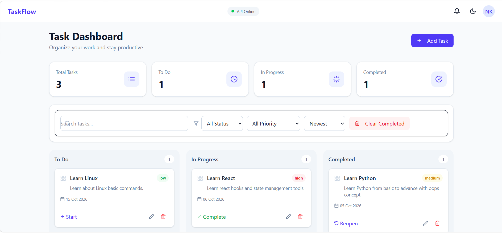

# TaskFlow – Smart Task Management System

TaskFlow is a full-stack task management application designed to help
users create, organize, track and manage tasks through a responsive
Kanban-style dashboard.

## 🚀 Features

- Create tasks
- Edit tasks
- Delete tasks
- Mark tasks as completed
- Move tasks between statuses
- Kanban board
- Native drag and drop
- Search tasks
- Filter by status
- Filter by priority
- Sort tasks
- Clear completed tasks
- Due-date validation
- Priority management
- Category management
- Toast notifications
- Confirmation dialogs
- Responsive UI
- Dark mode
- Backend health status
- REST API
- SQLite persistence
- LocalStorage cache/fallback
- API error handling

## 🛠️ Tech Stack

### Frontend

- React.js
- Vite
- Tailwind CSS
- Axios
- React Router
- React Icons

### Backend

- Python
- FastAPI
- Pydantic
- SQLAlchemy
- SQLite
- Uvicorn

## 🏗️ Architecture

```text
React + Tailwind CSS
        |
    Context API
        |
    Axios Service
        |
    FastAPI REST API
        |
     Pydantic
        |
    CRUD Layer
        |
    SQLAlchemy
        |
      SQLite

📁 Project Structure
TaskFlow/
├── frontend/
├── backend/
├── README.md
└── .gitignore
⚙️ Installation
1. Clone Repository
git clone YOUR_REPOSITORY_URL
cd TaskFlow
2. Frontend Setup
cd frontend
npm install

Create .env:

VITE_API_BASE_URL=http://localhost:8000/api
VITE_USE_API=true

Run:

npm run dev
3. Backend Setup

Open another terminal:

cd backend
python -m venv venv

Activate virtual environment.

Windows PowerShell:

.\venv\Scripts\Activate.ps1

Install dependencies:

pip install -r requirements.txt

Create .env:

DATABASE_URL=sqlite:///./taskflow.db
FRONTEND_URL=http://localhost:5173

Run:

uvicorn app.main:app --reload --port 8000
🔌 API Endpoints
Method	Endpoint	Description
GET	/api/tasks	Get all tasks
POST	/api/tasks	Create task
GET	/api/tasks/{id}	Get task
PUT	/api/tasks/{id}	Update task
PATCH	/api/tasks/{id}/status	Update status
DELETE	/api/tasks/{id}	Delete task
DELETE	/api/tasks/completed	Clear completed
💾 Data Persistence

TaskFlow uses SQLite as the primary database.

LocalStorage is also used as a client-side cache and fallback when
the backend is temporarily unavailable.

🔎 Search, Filter & Sort

Users can:

Search by task title
Search by description
Search by category
Filter by status
Filter overdue tasks
Filter by priority
Sort by creation date
Sort by due date
Sort by priority
📋 Kanban Workflow
TODO
  ↓
IN PROGRESS
  ↓
COMPLETED

Tasks can also be moved using drag and drop.

🧪 Validation

TaskFlow validates:

Required title
Minimum title length
Required due date
Future due date
Valid priority
Valid status

Validation is implemented on both frontend and backend.

🔐 Environment Variables

Sensitive configuration files such as .env are excluded from Git.

An .env.example file is provided for setup reference.

📸 Screenshots

Add screenshots here:


Dashboard
Add Task Modal
Kanban Board
Search and Filter
Dark Mode
API Documentation
🎥 Demo

Add Loom demonstration link here.

📚 JavaScript Concepts Demonstrated

This project demonstrates:

Variables
Functions
Arrow functions
ES6 modules
Objects and arrays
Array methods
Event handling
Form handling
DOM/event concepts through React
State management
Context API
Async/Await
Promises
API integration
Error handling
LocalStorage
Drag and Drop events
🔮 Future Improvements
User authentication
Role-based access
PostgreSQL
Task reminders
Email notifications
Team collaboration
Real-time updates
Analytics dashboard


👨‍💻 Author

Nandan Kumar
Developer Intern :- Nestorbird
